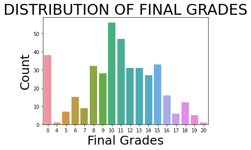

# Student-Grade-Prediction
 Student-Grade-Prediction with Python
# <center> STUDENT GRADE PREDICTION </center>

# <center> PYTHON PROJECT </center>


```python
import pandas as pd
import numpy as np
import matplotlib.pyplot as plt
import seaborn as sns
```


```python
studentData = pd.read_csv('student-mat.csv')
studentData.head(10)
```


<div>
<style scoped>
    .dataframe tbody tr th:only-of-type {
        vertical-align: middle;
    }

    .dataframe tbody tr th {
        vertical-align: top;
    }

    .dataframe thead th {
        text-align: right;
    }
</style>
<table border="1" class="dataframe">
  <thead>
    <tr style="text-align: right;">
      <th></th>
      <th>school</th>
      <th>sex</th>
      <th>age</th>
      <th>address</th>
      <th>famsize</th>
      <th>Pstatus</th>
      <th>Medu</th>
      <th>Fedu</th>
      <th>Mjob</th>
      <th>Fjob</th>
      <th>...</th>
      <th>famrel</th>
      <th>freetime</th>
      <th>goout</th>
      <th>Dalc</th>
      <th>Walc</th>
      <th>health</th>
      <th>absences</th>
      <th>G1</th>
      <th>G2</th>
      <th>G3</th>
    </tr>
  </thead>
  <tbody>
    <tr>
      <th>0</th>
      <td>GP</td>
      <td>F</td>
      <td>18</td>
      <td>U</td>
      <td>GT3</td>
      <td>A</td>
      <td>4</td>
      <td>4</td>
      <td>at_home</td>
      <td>teacher</td>
      <td>...</td>
      <td>4</td>
      <td>3</td>
      <td>4</td>
      <td>1</td>
      <td>1</td>
      <td>3</td>
      <td>6</td>
      <td>5</td>
      <td>6</td>
      <td>6</td>
    </tr>
    <tr>
      <th>1</th>
      <td>GP</td>
      <td>F</td>
      <td>17</td>
      <td>U</td>
      <td>GT3</td>
      <td>T</td>
      <td>1</td>
      <td>1</td>
      <td>at_home</td>
      <td>other</td>
      <td>...</td>
      <td>5</td>
      <td>3</td>
      <td>3</td>
      <td>1</td>
      <td>1</td>
      <td>3</td>
      <td>4</td>
      <td>5</td>
      <td>5</td>
      <td>6</td>
    </tr>
    <tr>
      <th>2</th>
      <td>GP</td>
      <td>F</td>
      <td>15</td>
      <td>U</td>
      <td>LE3</td>
      <td>T</td>
      <td>1</td>
      <td>1</td>
      <td>at_home</td>
      <td>other</td>
      <td>...</td>
      <td>4</td>
      <td>3</td>
      <td>2</td>
      <td>2</td>
      <td>3</td>
      <td>3</td>
      <td>10</td>
      <td>7</td>
      <td>8</td>
      <td>10</td>
    </tr>
    <tr>
      <th>3</th>
      <td>GP</td>
      <td>F</td>
      <td>15</td>
      <td>U</td>
      <td>GT3</td>
      <td>T</td>
      <td>4</td>
      <td>2</td>
      <td>health</td>
      <td>services</td>
      <td>...</td>
      <td>3</td>
      <td>2</td>
      <td>2</td>
      <td>1</td>
      <td>1</td>
      <td>5</td>
      <td>2</td>
      <td>15</td>
      <td>14</td>
      <td>15</td>
    </tr>
    <tr>
      <th>4</th>
      <td>GP</td>
      <td>F</td>
      <td>16</td>
      <td>U</td>
      <td>GT3</td>
      <td>T</td>
      <td>3</td>
      <td>3</td>
      <td>other</td>
      <td>other</td>
      <td>...</td>
      <td>4</td>
      <td>3</td>
      <td>2</td>
      <td>1</td>
      <td>2</td>
      <td>5</td>
      <td>4</td>
      <td>6</td>
      <td>10</td>
      <td>10</td>
    </tr>
    <tr>
      <th>5</th>
      <td>GP</td>
      <td>M</td>
      <td>16</td>
      <td>U</td>
      <td>LE3</td>
      <td>T</td>
      <td>4</td>
      <td>3</td>
      <td>services</td>
      <td>other</td>
      <td>...</td>
      <td>5</td>
      <td>4</td>
      <td>2</td>
      <td>1</td>
      <td>2</td>
      <td>5</td>
      <td>10</td>
      <td>15</td>
      <td>15</td>
      <td>15</td>
    </tr>
    <tr>
      <th>6</th>
      <td>GP</td>
      <td>M</td>
      <td>16</td>
      <td>U</td>
      <td>LE3</td>
      <td>T</td>
      <td>2</td>
      <td>2</td>
      <td>other</td>
      <td>other</td>
      <td>...</td>
      <td>4</td>
      <td>4</td>
      <td>4</td>
      <td>1</td>
      <td>1</td>
      <td>3</td>
      <td>0</td>
      <td>12</td>
      <td>12</td>
      <td>11</td>
    </tr>
    <tr>
      <th>7</th>
      <td>GP</td>
      <td>F</td>
      <td>17</td>
      <td>U</td>
      <td>GT3</td>
      <td>A</td>
      <td>4</td>
      <td>4</td>
      <td>other</td>
      <td>teacher</td>
      <td>...</td>
      <td>4</td>
      <td>1</td>
      <td>4</td>
      <td>1</td>
      <td>1</td>
      <td>1</td>
      <td>6</td>
      <td>6</td>
      <td>5</td>
      <td>6</td>
    </tr>
    <tr>
      <th>8</th>
      <td>GP</td>
      <td>M</td>
      <td>15</td>
      <td>U</td>
      <td>LE3</td>
      <td>A</td>
      <td>3</td>
      <td>2</td>
      <td>services</td>
      <td>other</td>
      <td>...</td>
      <td>4</td>
      <td>2</td>
      <td>2</td>
      <td>1</td>
      <td>1</td>
      <td>1</td>
      <td>0</td>
      <td>16</td>
      <td>18</td>
      <td>19</td>
    </tr>
    <tr>
      <th>9</th>
      <td>GP</td>
      <td>M</td>
      <td>15</td>
      <td>U</td>
      <td>GT3</td>
      <td>T</td>
      <td>3</td>
      <td>4</td>
      <td>other</td>
      <td>other</td>
      <td>...</td>
      <td>5</td>
      <td>5</td>
      <td>1</td>
      <td>1</td>
      <td>1</td>
      <td>5</td>
      <td>0</td>
      <td>14</td>
      <td>15</td>
      <td>15</td>
    </tr>
  </tbody>
</table>
<p>10 rows × 33 columns</p>
</div>


### ALL COLUMNS IN DATASET


```python
studentData.columns
```


    Index(['school', 'sex', 'age', 'address', 'famsize', 'Pstatus', 'Medu', 'Fedu',
           'Mjob', 'Fjob', 'reason', 'guardian', 'traveltime', 'studytime',
           'failures', 'schoolsup', 'famsup', 'paid', 'activities', 'nursery',
           'higher', 'internet', 'romantic', 'famrel', 'freetime', 'goout', 'Dalc',
           'Walc', 'health', 'absences', 'G1', 'G2', 'G3'],
          dtype='object')


### FINAL GRADES


```python
fGrade = studentData['G3']
fGrade.describe()
```


    count    395.000000
    mean      10.415190
    std        4.581443
    min        0.000000
    25%        8.000000
    50%       11.000000
    75%       14.000000
    max       20.000000
    Name: G3, dtype: float64


```python
cPlot = sns.countplot(studentData['G3'])
plt.title("DISTRIBUTION OF FINAL GRADES",fontsize=30)
plt.xlabel('Final Grades',fontsize = 25)
plt.ylabel('Count',fontsize = 25)
plt.show()
```

    E:\Anaconda\lib\site-packages\seaborn\_decorators.py:36: FutureWarning: Pass the following variable as a keyword arg: x. From version 0.12, the only valid positional argument will be `data`, and passing other arguments without an explicit keyword will result in an error or misinterpretation.
      warnings.warn(
    


    

    


### Finding Total male/female student in the dataset


```python
totalboys = len(studentData[studentData['sex'] == 'M'])
totalgirls = len(studentData[studentData['sex'] == 'F'])
print(f"Number of Boys : {totalboys}")
print(f"Number of Girls : {totalgirls}")
```

    Number of Boys : 187
    Number of Girls : 208
    

### Now we will drop the unwanted columns 


```python
data_dum = studentData
```


```python
data_dum.drop(["school","age"], axis = 1 , inplace = True)
```


```python
data_dum.head()
```


<div>
<style scoped>
    .dataframe tbody tr th:only-of-type {
        vertical-align: middle;
    }

    .dataframe tbody tr th {
        vertical-align: top;
    }

    .dataframe thead th {
        text-align: right;
    }
</style>
<table border="1" class="dataframe">
  <thead>
    <tr style="text-align: right;">
      <th></th>
      <th>sex</th>
      <th>address</th>
      <th>famsize</th>
      <th>Pstatus</th>
      <th>Medu</th>
      <th>Fedu</th>
      <th>Mjob</th>
      <th>Fjob</th>
      <th>reason</th>
      <th>guardian</th>
      <th>...</th>
      <th>famrel</th>
      <th>freetime</th>
      <th>goout</th>
      <th>Dalc</th>
      <th>Walc</th>
      <th>health</th>
      <th>absences</th>
      <th>G1</th>
      <th>G2</th>
      <th>G3</th>
    </tr>
  </thead>
  <tbody>
    <tr>
      <th>0</th>
      <td>F</td>
      <td>U</td>
      <td>GT3</td>
      <td>A</td>
      <td>4</td>
      <td>4</td>
      <td>at_home</td>
      <td>teacher</td>
      <td>course</td>
      <td>mother</td>
      <td>...</td>
      <td>4</td>
      <td>3</td>
      <td>4</td>
      <td>1</td>
      <td>1</td>
      <td>3</td>
      <td>6</td>
      <td>5</td>
      <td>6</td>
      <td>6</td>
    </tr>
    <tr>
      <th>1</th>
      <td>F</td>
      <td>U</td>
      <td>GT3</td>
      <td>T</td>
      <td>1</td>
      <td>1</td>
      <td>at_home</td>
      <td>other</td>
      <td>course</td>
      <td>father</td>
      <td>...</td>
      <td>5</td>
      <td>3</td>
      <td>3</td>
      <td>1</td>
      <td>1</td>
      <td>3</td>
      <td>4</td>
      <td>5</td>
      <td>5</td>
      <td>6</td>
    </tr>
    <tr>
      <th>2</th>
      <td>F</td>
      <td>U</td>
      <td>LE3</td>
      <td>T</td>
      <td>1</td>
      <td>1</td>
      <td>at_home</td>
      <td>other</td>
      <td>other</td>
      <td>mother</td>
      <td>...</td>
      <td>4</td>
      <td>3</td>
      <td>2</td>
      <td>2</td>
      <td>3</td>
      <td>3</td>
      <td>10</td>
      <td>7</td>
      <td>8</td>
      <td>10</td>
    </tr>
    <tr>
      <th>3</th>
      <td>F</td>
      <td>U</td>
      <td>GT3</td>
      <td>T</td>
      <td>4</td>
      <td>2</td>
      <td>health</td>
      <td>services</td>
      <td>home</td>
      <td>mother</td>
      <td>...</td>
      <td>3</td>
      <td>2</td>
      <td>2</td>
      <td>1</td>
      <td>1</td>
      <td>5</td>
      <td>2</td>
      <td>15</td>
      <td>14</td>
      <td>15</td>
    </tr>
    <tr>
      <th>4</th>
      <td>F</td>
      <td>U</td>
      <td>GT3</td>
      <td>T</td>
      <td>3</td>
      <td>3</td>
      <td>other</td>
      <td>other</td>
      <td>home</td>
      <td>father</td>
      <td>...</td>
      <td>4</td>
      <td>3</td>
      <td>2</td>
      <td>1</td>
      <td>2</td>
      <td>5</td>
      <td>4</td>
      <td>6</td>
      <td>10</td>
      <td>10</td>
    </tr>
  </tbody>
</table>
<p>5 rows × 31 columns</p>
</div>


```python
data_dum.columns
```


    Index(['sex', 'address', 'famsize', 'Pstatus', 'Medu', 'Fedu', 'Mjob', 'Fjob',
           'reason', 'guardian', 'traveltime', 'studytime', 'failures',
           'schoolsup', 'famsup', 'paid', 'activities', 'nursery', 'higher',
           'internet', 'romantic', 'famrel', 'freetime', 'goout', 'Dalc', 'Walc',
           'health', 'absences', 'G1', 'G2', 'G3'],
          dtype='object')


### Now we do Maping  ( Yes or No )


```python
d = {'yes' : 1 , 'no' : 0 }
data_dum['schoolsup']= data_dum['schoolsup'].map(d)
data_dum['famsup']= data_dum['famsup'].map(d)
data_dum['paid']= data_dum['paid'].map(d)
data_dum['activities']= data_dum['activities'].map(d)
data_dum['nursery']= data_dum['nursery'].map(d)
data_dum['higher']= data_dum['higher'].map(d)
data_dum['internet']= data_dum['internet'].map(d)
data_dum['romantic']= data_dum['romantic'].map(d)
```


```python
d = {'F': 1, 'M': 0}
data_dum['sex'] = data_dum['sex'].map(d)

# map the address data
d = {'U': 1, 'R': 0}
data_dum['address'] = data_dum['address'].map(d)

# map the famili size data
d = {'LE3': 1, 'GT3': 0}
data_dum['famsize'] = data_dum['famsize'].map(d)

# map the parent's status
d= {'T': 1, 'A': 0}
data_dum['Pstatus'] = data_dum['Pstatus'].map(d)

# map the parent's job
d = {'teacher': 0, 'health': 1, 'services': 2,'at_home': 3,'other': 4}
data_dum['Mjob'] = data_dum['Mjob'].map(d)
data_dum['Fjob'] = data_dum['Fjob'].map(d)

# map the reason data
d= {'home': 0, 'reputation': 1, 'course': 2,'other': 3}
data_dum['reason'] = data_dum['reason'].map(d)

# map the guardian data
d = {'mother': 0, 'father': 1, 'other': 2}
data_dum['guardian'] = data_dum['guardian'].map(d)
```


```python
data_dum.columns
```


    Index(['sex', 'address', 'famsize', 'Pstatus', 'Medu', 'Fedu', 'Mjob', 'Fjob',
           'reason', 'guardian', 'traveltime', 'studytime', 'failures',
           'schoolsup', 'famsup', 'paid', 'activities', 'nursery', 'higher',
           'internet', 'romantic', 'famrel', 'freetime', 'goout', 'Dalc', 'Walc',
           'health', 'absences', 'G1', 'G2', 'G3'],
          dtype='object')


### Importing SKlearn to train the mdoel


```python
from sklearn.model_selection import train_test_split
x = data_dum.drop('G3',axis=1)
y = data_dum['G3']
```


```python
data_dum['G3']
```


    0       6
    1       6
    2      10
    3      15
    4      10
           ..
    390     9
    391    16
    392     7
    393    10
    394     9
    Name: G3, Length: 395, dtype: int64


```python
X_train, X_test, y_train, y_test = train_test_split(x,y, test_size = 0.20, random_state=44)
```


```python
from sklearn.linear_model import LinearRegression
```


```python
L = LinearRegression()
```


```python
data_dum.head(20)
```


<div>
<style scoped>
    .dataframe tbody tr th:only-of-type {
        vertical-align: middle;
    }

    .dataframe tbody tr th {
        vertical-align: top;
    }

    .dataframe thead th {
        text-align: right;
    }
</style>
<table border="1" class="dataframe">
  <thead>
    <tr style="text-align: right;">
      <th></th>
      <th>sex</th>
      <th>address</th>
      <th>famsize</th>
      <th>Pstatus</th>
      <th>Medu</th>
      <th>Fedu</th>
      <th>Mjob</th>
      <th>Fjob</th>
      <th>reason</th>
      <th>guardian</th>
      <th>...</th>
      <th>famrel</th>
      <th>freetime</th>
      <th>goout</th>
      <th>Dalc</th>
      <th>Walc</th>
      <th>health</th>
      <th>absences</th>
      <th>G1</th>
      <th>G2</th>
      <th>G3</th>
    </tr>
  </thead>
  <tbody>
    <tr>
      <th>0</th>
      <td>1</td>
      <td>1</td>
      <td>0</td>
      <td>0</td>
      <td>4</td>
      <td>4</td>
      <td>3</td>
      <td>0</td>
      <td>2</td>
      <td>0</td>
      <td>...</td>
      <td>4</td>
      <td>3</td>
      <td>4</td>
      <td>1</td>
      <td>1</td>
      <td>3</td>
      <td>6</td>
      <td>5</td>
      <td>6</td>
      <td>6</td>
    </tr>
    <tr>
      <th>1</th>
      <td>1</td>
      <td>1</td>
      <td>0</td>
      <td>1</td>
      <td>1</td>
      <td>1</td>
      <td>3</td>
      <td>4</td>
      <td>2</td>
      <td>1</td>
      <td>...</td>
      <td>5</td>
      <td>3</td>
      <td>3</td>
      <td>1</td>
      <td>1</td>
      <td>3</td>
      <td>4</td>
      <td>5</td>
      <td>5</td>
      <td>6</td>
    </tr>
    <tr>
      <th>2</th>
      <td>1</td>
      <td>1</td>
      <td>1</td>
      <td>1</td>
      <td>1</td>
      <td>1</td>
      <td>3</td>
      <td>4</td>
      <td>3</td>
      <td>0</td>
      <td>...</td>
      <td>4</td>
      <td>3</td>
      <td>2</td>
      <td>2</td>
      <td>3</td>
      <td>3</td>
      <td>10</td>
      <td>7</td>
      <td>8</td>
      <td>10</td>
    </tr>
    <tr>
      <th>3</th>
      <td>1</td>
      <td>1</td>
      <td>0</td>
      <td>1</td>
      <td>4</td>
      <td>2</td>
      <td>1</td>
      <td>2</td>
      <td>0</td>
      <td>0</td>
      <td>...</td>
      <td>3</td>
      <td>2</td>
      <td>2</td>
      <td>1</td>
      <td>1</td>
      <td>5</td>
      <td>2</td>
      <td>15</td>
      <td>14</td>
      <td>15</td>
    </tr>
    <tr>
      <th>4</th>
      <td>1</td>
      <td>1</td>
      <td>0</td>
      <td>1</td>
      <td>3</td>
      <td>3</td>
      <td>4</td>
      <td>4</td>
      <td>0</td>
      <td>1</td>
      <td>...</td>
      <td>4</td>
      <td>3</td>
      <td>2</td>
      <td>1</td>
      <td>2</td>
      <td>5</td>
      <td>4</td>
      <td>6</td>
      <td>10</td>
      <td>10</td>
    </tr>
    <tr>
      <th>5</th>
      <td>0</td>
      <td>1</td>
      <td>1</td>
      <td>1</td>
      <td>4</td>
      <td>3</td>
      <td>2</td>
      <td>4</td>
      <td>1</td>
      <td>0</td>
      <td>...</td>
      <td>5</td>
      <td>4</td>
      <td>2</td>
      <td>1</td>
      <td>2</td>
      <td>5</td>
      <td>10</td>
      <td>15</td>
      <td>15</td>
      <td>15</td>
    </tr>
    <tr>
      <th>6</th>
      <td>0</td>
      <td>1</td>
      <td>1</td>
      <td>1</td>
      <td>2</td>
      <td>2</td>
      <td>4</td>
      <td>4</td>
      <td>0</td>
      <td>0</td>
      <td>...</td>
      <td>4</td>
      <td>4</td>
      <td>4</td>
      <td>1</td>
      <td>1</td>
      <td>3</td>
      <td>0</td>
      <td>12</td>
      <td>12</td>
      <td>11</td>
    </tr>
    <tr>
      <th>7</th>
      <td>1</td>
      <td>1</td>
      <td>0</td>
      <td>0</td>
      <td>4</td>
      <td>4</td>
      <td>4</td>
      <td>0</td>
      <td>0</td>
      <td>0</td>
      <td>...</td>
      <td>4</td>
      <td>1</td>
      <td>4</td>
      <td>1</td>
      <td>1</td>
      <td>1</td>
      <td>6</td>
      <td>6</td>
      <td>5</td>
      <td>6</td>
    </tr>
    <tr>
      <th>8</th>
      <td>0</td>
      <td>1</td>
      <td>1</td>
      <td>0</td>
      <td>3</td>
      <td>2</td>
      <td>2</td>
      <td>4</td>
      <td>0</td>
      <td>0</td>
      <td>...</td>
      <td>4</td>
      <td>2</td>
      <td>2</td>
      <td>1</td>
      <td>1</td>
      <td>1</td>
      <td>0</td>
      <td>16</td>
      <td>18</td>
      <td>19</td>
    </tr>
    <tr>
      <th>9</th>
      <td>0</td>
      <td>1</td>
      <td>0</td>
      <td>1</td>
      <td>3</td>
      <td>4</td>
      <td>4</td>
      <td>4</td>
      <td>0</td>
      <td>0</td>
      <td>...</td>
      <td>5</td>
      <td>5</td>
      <td>1</td>
      <td>1</td>
      <td>1</td>
      <td>5</td>
      <td>0</td>
      <td>14</td>
      <td>15</td>
      <td>15</td>
    </tr>
    <tr>
      <th>10</th>
      <td>1</td>
      <td>1</td>
      <td>0</td>
      <td>1</td>
      <td>4</td>
      <td>4</td>
      <td>0</td>
      <td>1</td>
      <td>1</td>
      <td>0</td>
      <td>...</td>
      <td>3</td>
      <td>3</td>
      <td>3</td>
      <td>1</td>
      <td>2</td>
      <td>2</td>
      <td>0</td>
      <td>10</td>
      <td>8</td>
      <td>9</td>
    </tr>
    <tr>
      <th>11</th>
      <td>1</td>
      <td>1</td>
      <td>0</td>
      <td>1</td>
      <td>2</td>
      <td>1</td>
      <td>2</td>
      <td>4</td>
      <td>1</td>
      <td>1</td>
      <td>...</td>
      <td>5</td>
      <td>2</td>
      <td>2</td>
      <td>1</td>
      <td>1</td>
      <td>4</td>
      <td>4</td>
      <td>10</td>
      <td>12</td>
      <td>12</td>
    </tr>
    <tr>
      <th>12</th>
      <td>0</td>
      <td>1</td>
      <td>1</td>
      <td>1</td>
      <td>4</td>
      <td>4</td>
      <td>1</td>
      <td>2</td>
      <td>2</td>
      <td>1</td>
      <td>...</td>
      <td>4</td>
      <td>3</td>
      <td>3</td>
      <td>1</td>
      <td>3</td>
      <td>5</td>
      <td>2</td>
      <td>14</td>
      <td>14</td>
      <td>14</td>
    </tr>
    <tr>
      <th>13</th>
      <td>0</td>
      <td>1</td>
      <td>0</td>
      <td>1</td>
      <td>4</td>
      <td>3</td>
      <td>0</td>
      <td>4</td>
      <td>2</td>
      <td>0</td>
      <td>...</td>
      <td>5</td>
      <td>4</td>
      <td>3</td>
      <td>1</td>
      <td>2</td>
      <td>3</td>
      <td>2</td>
      <td>10</td>
      <td>10</td>
      <td>11</td>
    </tr>
    <tr>
      <th>14</th>
      <td>0</td>
      <td>1</td>
      <td>0</td>
      <td>0</td>
      <td>2</td>
      <td>2</td>
      <td>4</td>
      <td>4</td>
      <td>0</td>
      <td>2</td>
      <td>...</td>
      <td>4</td>
      <td>5</td>
      <td>2</td>
      <td>1</td>
      <td>1</td>
      <td>3</td>
      <td>0</td>
      <td>14</td>
      <td>16</td>
      <td>16</td>
    </tr>
    <tr>
      <th>15</th>
      <td>1</td>
      <td>1</td>
      <td>0</td>
      <td>1</td>
      <td>4</td>
      <td>4</td>
      <td>1</td>
      <td>4</td>
      <td>0</td>
      <td>0</td>
      <td>...</td>
      <td>4</td>
      <td>4</td>
      <td>4</td>
      <td>1</td>
      <td>2</td>
      <td>2</td>
      <td>4</td>
      <td>14</td>
      <td>14</td>
      <td>14</td>
    </tr>
    <tr>
      <th>16</th>
      <td>1</td>
      <td>1</td>
      <td>0</td>
      <td>1</td>
      <td>4</td>
      <td>4</td>
      <td>2</td>
      <td>2</td>
      <td>1</td>
      <td>0</td>
      <td>...</td>
      <td>3</td>
      <td>2</td>
      <td>3</td>
      <td>1</td>
      <td>2</td>
      <td>2</td>
      <td>6</td>
      <td>13</td>
      <td>14</td>
      <td>14</td>
    </tr>
    <tr>
      <th>17</th>
      <td>1</td>
      <td>1</td>
      <td>0</td>
      <td>1</td>
      <td>3</td>
      <td>3</td>
      <td>4</td>
      <td>4</td>
      <td>1</td>
      <td>0</td>
      <td>...</td>
      <td>5</td>
      <td>3</td>
      <td>2</td>
      <td>1</td>
      <td>1</td>
      <td>4</td>
      <td>4</td>
      <td>8</td>
      <td>10</td>
      <td>10</td>
    </tr>
    <tr>
      <th>18</th>
      <td>0</td>
      <td>1</td>
      <td>0</td>
      <td>1</td>
      <td>3</td>
      <td>2</td>
      <td>2</td>
      <td>2</td>
      <td>2</td>
      <td>0</td>
      <td>...</td>
      <td>5</td>
      <td>5</td>
      <td>5</td>
      <td>2</td>
      <td>4</td>
      <td>5</td>
      <td>16</td>
      <td>6</td>
      <td>5</td>
      <td>5</td>
    </tr>
    <tr>
      <th>19</th>
      <td>0</td>
      <td>1</td>
      <td>1</td>
      <td>1</td>
      <td>4</td>
      <td>3</td>
      <td>1</td>
      <td>4</td>
      <td>0</td>
      <td>1</td>
      <td>...</td>
      <td>3</td>
      <td>1</td>
      <td>3</td>
      <td>1</td>
      <td>3</td>
      <td>5</td>
      <td>4</td>
      <td>8</td>
      <td>10</td>
      <td>10</td>
    </tr>
  </tbody>
</table>
<p>20 rows × 31 columns</p>
</div>


```python
L.fit(X_train, y_train)
```


    LinearRegression()


```python
y_pred=L.predict(X_test)
```


```python
print(L.score(X_test, y_test)) 
```

    0.8544809615370685
    

# So we can see that 85% is the accuracy of the model 

### It means that the model is Working perfectly fine :)

# <center> PROJECT BY : @YASIRKHANA </center> 


```python

```
